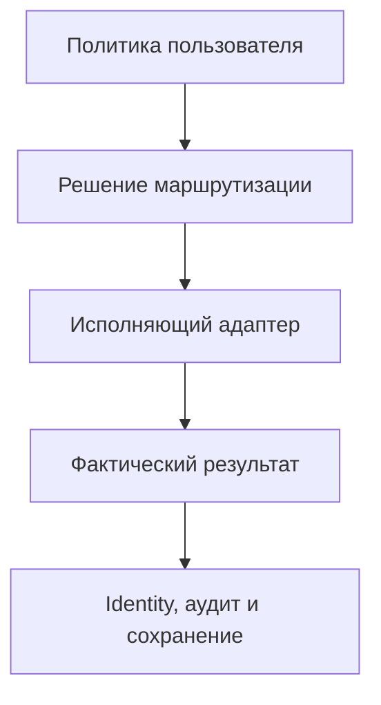

# AI Movie Studio Studio Edition
## Единый план стабилизации, исправления P0 и дальнейшей разработки

**Дата:** 2026-09-02
**Статус документа:** проект решения для утверждения Product Owner
**Product Owner:** Сергей
**Подготовлено:** Джарвис (GPT)
**Обязательные входные данные:** утверждённая спецификация, аудит 2026-08-15, проверка GitHub, локальный аудит Codex, локальный тестовый прогон и рекомендации Copilot

---

## 1. Назначение документа

Этот документ объединяет всю подтверждённую информацию о текущем состоянии AI Movie Studio Studio Edition и устанавливает единый порядок дальнейшей работы.

Он предназначен для Сергея, Джарвиса, Copilot, локального Codex, Qwen и среды Cursor. Документ не разрешает автоматически менять архитектуру или код: каждый архитектурный переход и каждый этап реализации проходят отдельные ворота утверждения.

Главная цель ближайшего цикла — восстановить честную и доказуемую цепочку:



Выбранный провайдер и модель должны совпадать с фактическим исполнителем. Любая недоступность или несовместимость должна приводить к явному отказу либо к разрешённому политикой fallback, но не к скрытой подмене.

---

## 2. Единая оценка состояния

### 2.1 Операционная рекомендация AI Council

| Направление | Рекомендация |
|---|---|
| Продолжение стабилизации | **GO** |
| Новые реальные Provider Integrations | **NO-GO** до закрытия обязательных ворот |
| Общий статус проекта | **GO WITH CONDITIONS** |
| PixVerse production readiness | **NOT READY** |

Формулировки `GO`, `NO-GO` и `GO WITH CONDITIONS` становятся окончательным решением только после подтверждения Сергея как Product Owner.

`NOT READY` не означает остановку проекта. Это означает, что PixVerse и другие реальные провайдеры пока нельзя объявлять рабочими production-интеграциями.

### 2.2 Что уже доказано положительно

- Проект имеет работоспособную тестируемую основу.
- Локальный полный прогон завершился результатом `74 passed in 1.81s`.
- После тестов рабочее дерево не изменилось.
- Предыдущие исправления identity propagation для `scene_id` и `shot_id` сохранены.
- PixVerse физически размещён в Provider Layer.
- PixVerse использует `CredentialManager` и не требует размещения ключа в каталоге провайдеров.
- `.ai_council` не импортируется Runtime, что соответствует разделению governance/runtime.
- Первичное добавление обычных сцен в Timeline выполняется последовательно.

### 2.3 Что не доказано зелёными тестами

Текущие 74 теста не покрывают:

- равенство выбранного и фактически исполняющего провайдера;
- применение ModelPolicy на runtime-границе;
- отклонение hard-incompatible кандидатов;
- корректную интерпретацию `media_types`;
- регистрацию PixVerse и RemoteVideoProvider;
- отсутствие alias `PixVerse -> Video AI`;
- реальный маршрут Generation UI;
- persistence/restore reactive state;
- замену сцены при regeneration;
- изменение фактических prompts после master prompt;
- HTTP-контракт и end-to-end исполнение PixVerse;
- реальные реализации WaveSpeed и Kling.

Зелёный regression suite подтверждает отсутствие известных регрессий, но не закрывает перечисленные пробелы.

---

## 3. Источники истины и подтверждённый baseline

### 3.1 Использованные источники

1. `PROJECT_SPEC.md` — продуктовые и архитектурные ограничения.
2. `TASK.md` — фазовая дисциплина и статусы ранних этапов.
3. `PROJECT_AUDIT_2026-08-15(1).md` — первый stabilization audit.
4. `README.md` и `CHANGELOG.md` — заявленное состояние.
5. Независимая проверка GitHub Джарвисом.
6. Полный статический read-only аудит локальной копии Codex.
7. Фактический локальный прогон `pytest`: 74 passed.
8. Заключение и рекомендации Copilot.

### 3.2 Git baseline локального аудита

- Branch: `main`
- HEAD: `820ed1aac626e80ccf1049a2e51d8a199020035a`
- Локальная ссылка `origin/main`: тот же SHA
- По локальной ссылке: `0 ahead / 0 behind`
- Реальный remote не проверялся через `git fetch` в рамках read-only аудита
- Modified tracked files: 6
- Expanded untracked files: 37
- Staged files: 0
- Working tree: dirty

Изменённые tracked-файлы:

- `.gitignore`
- `CHANGELOG.md`
- `PROJECT_SPEC.md`
- `README.md`
- `core/ai_core/providers/__init__.py`
- `core/ai_core/providers/video/__init__.py`

Критически важные untracked-группы:

- `.ai_council/**`
- `.cursor/**`
- `.vscode/**`
- architecture/governance/status documentation
- `core/ai_core/providers/video/pixverse_provider.py`
- `tests/test_pixverse_provider.py`
- backups спецификации, registry и документации
- structure snapshots

### 3.3 Покрытие локального аудита

- Найдено после исключений: 268 файлов.
- Полностью прочитано как UTF-8: 266 файлов.
- Не читались: `.env` из-за риска раскрытия секрета и бинарная SQLite-база.
- Прочитаны исходники, тесты, Markdown, JSON, конфигурация, `.ai_council`, `.cursor`, `.vscode`, backups и untracked-тексты.

---

## 4. Утверждённые архитектурные инварианты

1. AI Movie Studio — AI Production Operating System, а не простой генератор контента.
2. Core управляет проектом, политиками, оркестрацией, ассетами, Timeline, компиляцией и экспортом.
3. Core должен быть provider-agnostic и UI-independent.
4. WaveSpeed, Kling и PixVerse могут быть только реализациями Provider Layer.
5. Provider/model execution не должен жить в PyQt6 UI.
6. AI Director не имеет права скрыто заменять выбор пользователя.
7. `fixed`: выбранный provider/model обязателен; недоступность означает явный отказ.
8. `preferred`: fallback допустим только внутри упорядоченного approved set.
9. `automatic`: выбор допустим только внутри явно approved set.
10. Project-level policy имеет приоритет над global defaults.
11. Selected identity должна совпадать с execution identity.
12. Hard constraints фильтруют кандидатов до scoring.
13. Governance и AI Council не входят в Runtime imports.
14. Секреты не должны попадать в Git, отчёты, тестовые фикстуры или логи.
15. Документация обновляется только после доказательства runtime-кодом и тестами.
16. Архитектурные и стратегические изменения утверждает Сергей.

---

## 5. Роли и ответственность

| Участник | Ответственность |
|---|---|
| Сергей | Product Owner, финальное решение по архитектуре и стратегии |
| Джарвис | продуктовая стратегия, высокоуровневая архитектура, координация этапов |
| Copilot | Архитектор: проверка контрактов, рисков, плана и качества |
| Qwen/Ollama | Local Engineer / Analyst; не внедряется в Runtime/Core без отдельного решения |
| Cursor | среда реализации; не принимает архитектурных решений |
| Локальный Codex | инструмент локального анализа, тестирования и реализации в утверждённых границах |

Copilot обязан рассматривать каждый архитектурный этап. Его рекомендация является обязательным входом в решение, но не заменяет решение Product Owner.

---

## 6. Единый реестр проблем

| ID | Проблема | Статус | Приоритет | Зависимость |
|---|---|---|---|---|
| P0-1 | Generation UI не подключён, отсутствует импорт | CONFIRMED | P0 | Независимый узкий fix после provider identity |
| P0-2 | ModelPolicy не применяется Runtime | CONFIRMED | P0 | Авторитетная execution boundary |
| P0-3 | `PixVerse` скрыто заменяется на `Video AI` | CONFIRMED | P0 | Identity test и provider contract |
| P0-4 | `BaseAIProvider` и `BaseVideoProvider` несовместимы | CONFIRMED | P0 | Решение Product Owner |
| P0-5 | Reactive regeneration дублирует Timeline и не восстанавливает state | CONFIRMED | P0/P1 | После provider/policy stabilization |
| P0-6 | Первичный Timeline overlap | NOT CONFIRMED | Закрыто уточнением | Обычный Timeline последовательный |
| P0-6A | Regeneration создаёт duplicate scene | CONFIRMED | P0/P1 | Reactive phase |
| P0-6B | 8K может снизиться до 4K | POLICY GAP | P0 | ModelPolicy/QualityPolicy semantics |
| P0-7 | ProviderPool читает `media_type` вместо `media_types` | CONFIRMED | P0 | Capability contract |
| P0-8 | CapabilityMatcher сохраняет hard-incompatible candidates | CONFIRMED | P0 | Capability contract |
| P0-9 | PixVerse физически корректен, но не runtime-integrated | PARTIAL | P0 | P0-3, P0-4, P0-7, P0-8 |
| P0-10 | Документация опережает Runtime | CONFIRMED | P1 | После кодовых исправлений |
| A-1 | Несколько параллельных Router/Registry/Manager | CONFIRMED | Architecture | Microaudit, без mass refactor |
| A-2 | ProviderCatalog выбирает metadata, другой manager исполняет | CONFIRMED | Architecture | Identity chain |
| A-3 | MoviePipeline создаёт concrete VideoProvider | CONFIRMED | Architecture | Provider contract |
| A-4 | `VideoRouter.select(model=...)` сравнивает model с provider.name | CONFIRMED | P0 | Identity semantics |
| A-5 | Core и UI имеют разные ModelPolicy | CONFIRMED | P0 | Policy consolidation |
| A-6 | WaveSpeed/Kling заявлены, но Runtime implementations не подтверждены | CONFIRMED | Roadmap | После общей provider framework |

---

## 7. Решение по рекомендациям Copilot

### 7.1 Принято без изменений

- Стабилизацию продолжать.
- Реальные Provider Integrations временно не подключать.
- Следующим действием провести один microaudit provider identity.
- Первым создать только один regression test: `tests/test_provider_execution_identity.py`.
- Не коммитить текущий PixVerseProvider как рабочую интеграцию.
- Не исправлять одновременно UI, ModelPolicy и Reactive Orchestrator.
- Не объединять массово Router-классы.
- Не смешивать документацию, Bridge, IDE settings и Runtime-код.
- Не удалять backups до отдельной cleanup-фазы.
- Не объявлять PixVerse рабочим провайдером.
- `CURRENT_STATE.md` обновлять до `74 passed` только отдельным документационным изменением.

### 7.2 Принято с обязательным уточнением

Regression test provider identity должен проверять инвариант стабильной идентичности:

```python
assert routed_provider_id == execution_provider_id
```

Допустимый временный вариант, если канонического `provider_id` в текущем контракте ещё нет:

```python
assert routed_provider_name == execution_provider_name
```

Запрещено сравнивать Python-объекты или экземпляры provider-классов: два экземпляра одного провайдера могут быть не равны как объекты и создать ложный RED.

Нормализация identity может устранять только технические различия записи, например пробелы или регистр. Она не должна превращать разные провайдеры в один alias. В частности, запрещено нормализовать `PixVerse` в `Video AI`, потому что это скроет проверяемый дефект.

Предпочтительная долгосрочная форма identity:

```text
routed_provider_id   = "pixverse"
execution_provider_id = "video_ai"
```

Ожидаемая причина RED:

```text
AssertionError: routed provider identity != execution provider identity
```

Текущее состояние `PixVerse != Video AI` должно дать ожидаемый RED. Тест не должен успешно проходить, узаконивая подмену. До разрешения production fix красный тест используется как доказательство и не сливается в `main` отдельно от исправления.

Тест обязан падать только по identity mismatch, а не по отсутствующему ключу, сети, GUI, импорту или несовместимому mock.

### 7.3 Требует решения Сергея

- Утверждение общего статуса `GO WITH CONDITIONS`.
- Выбор единого Provider Layer execution contract.
- Семантика downgrade качества в `fixed`, `preferred`, `automatic`.
- Модель persistence/rollback для reactive state.
- Какие governance/editor файлы входят в Git, а какие остаются локальными.

---

## 8. Общие правила исполнения плана

1. Один этап — одна проблема или тесно связанный контракт.
2. Каждый кодовый fix начинается с RED test.
3. После targeted GREEN запускается полный suite.
4. Baseline полного suite: 74 теста плюс новые тесты.
5. Каждый этап получает отдельный diff review Copilot.
6. Не выполнять mass refactor без отдельного ADR и решения Сергея.
7. Не использовать реальную сеть и платные API до специальной provider-validation фазы.
8. Не читать и не выводить `.env`.
9. Не удалять untracked/backups до snapshot и классификации.
10. Не смешивать code, tests, docs, governance и cleanup в одном commit.
11. Не использовать `git reset --hard`, `git clean`, принудительный checkout или иные необратимые команды.
12. После каждого этапа фиксировать тесты, diff, status, риски и rollback scope.

---

## 9. Dependency-ordered план действий

## Этап 0 — Сохранение и фиксация исходного состояния

**Цель:** исключить потерю 6 modified и 37 untracked файлов.

Действия:

1. Зафиксировать полный `git status` и список всех untracked-файлов.
2. Сохранить `git diff` tracked-изменений отдельно от проекта.
3. Создать восстанавливаемый timestamped snapshot проекта вне рабочей директории, исключая `.venv`, caches и секретное содержимое из публикуемых артефактов.
4. Проверить, что snapshot содержит PixVerse, тесты, governance, status и backups.
5. Только после snapshot выполнить read-only проверку актуального remote.
6. Сравнить настоящий remote HEAD с локальным `820ed1a...`.

Запрещено:

- clean/reset/stash;
- удаление backups;
- commit смешанного дерева;
- публикация `.env`.

Ворота выхода:

- состояние полностью восстанавливаемо;
- remote divergence известен;
- ни один локальный файл не потерян.

## Этап 1 — Microaudit provider execution identity

**Рекомендация Copilot: обязательна.**

Этап разделяется на два разрешения.

### Этап 1A — структура теста, только read-only

Локальный Codex сначала обязан:

1. Проследить фактический runtime-path.
2. Показать предполагаемую структуру теста.
3. Назвать fake/spy dependencies.
4. Указать источник routed identity и execution identity.
5. Объяснить, почему тест упадёт только по identity mismatch.
6. Не создавать и не изменять файлы.
7. Остановиться и ждать проверки Сергея, Джарвиса и Copilot.

### Этап 1B — создание одного RED test после отдельного разрешения

**Единственный разрешённый новый файл:**

```text
tests/test_provider_execution_identity.py
```

Тест должен:

1. Использовать fake/spy dependencies без сети и ключей.
2. Зафиксировать стабильный `routed_provider_id` или каноническое имя.
3. Зафиксировать стабильный `execution_provider_id` или каноническое имя.
4. Не сравнивать Python-объекты и экземпляры классов.
5. Проверить равенство стабильных identity.
6. На текущем коде дать RED именно из-за `PixVerse -> Video AI`.
7. Не использовать alias mapping при нормализации identity.
8. Показать фактически задействованный путь, а не предполагаемую схему.

Исследуемая цепочка:

```text
ProviderRouter / ProviderCatalog
        -> GenerationEngine
        -> ProviderManager
        -> ProviderRegistry, если реально участвует
        -> Execution Backend
```

Ворота выхода:

- RED воспроизводим;
- причина падения только identity mismatch;
- исключён ложный RED из-за object inequality;
- production-код не изменён;
- Copilot подтвердил фактический runtime-path;
- работа остановлена для решения Сергея.

## Этап 2 — Архитектурное решение Provider Contract

**Цель:** устранить несовместимость `BaseAIProvider` и `BaseVideoProvider`, не выполняя преждевременный mass refactor.

Copilot должен представить не более двух вариантов:

- область ответственности единого контракта;
- representation asynchronous jobs;
- register/select/execute/status/result lifecycle;
- совместимость существующих providers;
- migration cost;
- затрагиваемые файлы;
- rollback strategy;
- риски.

До решения Сергея код не менять.

Ворота выхода:

- выбран один authoritative execution contract;
- определён один authoritative execution path;
- роли Catalog/Router/Registry/Manager не пересекаются;
- решение записано как ADR;
- Сергей утвердил вариант.

## Этап 3 — Минимальное исправление execution identity

**Цель:** сделать test этапа 1 зелёным без подключения реального PixVerse API.

Действия после утверждения этапа 2:

1. Удалить или изолировать silent alias `PixVerse -> Video AI`.
2. Провести selected identity до execution boundary.
3. Если выбранный provider не зарегистрирован, завершать задачу явной ошибкой.
4. Зафиксировать requested, selected и executed provider/model в audit metadata.
5. Не выполнять live request.

Тесты:

- identity equality;
- explicit unavailable-provider failure;
- отсутствие fallback вне policy;
- полный suite.

Ворота выхода:

- identity test GREEN;
- нет silent substitution;
- полный suite GREEN;
- Copilot подтвердил отсутствие обходного execution path.

## Этап 4 — Runtime ModelPolicy

**Цель:** сделать пользовательский выбор обязательным для фактического исполнения.

Действия:

1. Определить одну каноническую policy-модель.
2. Передавать project policy от UI/project state до authoritative router.
3. Реализовать различимую семантику `fixed`, `preferred`, `automatic`.
4. Удалить или адаптировать дублирующую UI-policy без mass refactor.
5. Явно фиксировать причину fallback или refusal.

Обязательные RED/GREEN тесты:

- `fixed`: выбранный provider/model исполняется либо explicit failure;
- `preferred`: fallback только внутри ordered approved set;
- `automatic`: выбор только внутри approved set;
- project policy overrides global;
- неизвестный provider/model не исполняется.

Ворота выхода:

- UI/state policy реально влияет на execution;
- скрытая замена невозможна;
- полный suite GREEN.

## Этап 5 — Capability contract и hard filtering

**Цель:** исключить неправильную классификацию и несовместимый выбор.

Подэтап 5A:

- исправить `media_type` / `media_types` contract;
- добавить тесты video/image/music/voice;
- запретить default-to-video для валидного non-video provider.

Подэтап 5B:

- отделить hard constraints от soft scoring;
- удалить hard-incompatible candidates до ranking;
- при отсутствии кандидатов возвращать explicit incompatibility result.

Подэтап 5C:

- утвердить downgrade semantics;
- `fixed 8K` не снижать скрыто;
- для разрешённого downgrade хранить requested и actual quality и показывать пользователю.

Ворота выхода:

- hard-incompatible provider не может победить;
- media types классифицируются корректно;
- качество не меняется скрыто;
- полный suite GREEN.

## Этап 6 — Generation UI

**Цель:** подключить уже существующую страницу без смешивания с Provider Layer refactor.

Действия:

1. Добавить отсутствующий импорт `QPlainTextEdit`.
2. Подключить реальный Generation route.
3. Проверить привязку текущего project pipeline.
4. Не менять ModelPolicy и Reactive implementation в том же diff.

Тесты:

- импорт UI-модуля;
- navigation route;
- создание Generation widgets;
- отсутствие generic placeholder;
- полный suite и target-machine GUI smoke check.

Ворота выхода:

- страница доступна из UI;
- GUI не падает;
- diff ограничен UI и его тестами.

## Этап 7 — Reactive regeneration

**Цель:** сделать master prompt и regeneration семантически корректными.

Решения до реализации:

- replace, revision или versioned scene semantics;
- persistence format;
- rollback scope;
- Timeline identity rules.

Действия:

1. Обеспечить влияние master prompt на effective prompts.
2. Исключить случайное добавление duplicate scene.
3. Сохранять revision identity.
4. Реализовать persistence/restore.
5. Добавить rollback только после утверждения модели state.

Тесты:

- prompt changes;
- target scene replacement/revision;
- Timeline uniqueness;
- restart restore;
- history consistency;
- полный suite.

Ворота выхода:

- повторная генерация не повреждает Timeline;
- state восстанавливается;
- поведение видно пользователю и подтверждено тестами.

## Этап 8 — Offline-complete PixVerse adapter

Начинать только после этапов 2–5.

**Цель:** привести PixVerse к утверждённому Provider Layer contract без live paid request.

Действия:

1. Адаптировать PixVerse к authoritative contract.
2. Зарегистрировать через единственный approved execution path.
3. Удалить alias.
4. Проверить payload/headers/trace identity.
5. Реализовать response parsing, status lifecycle, timeout, malformed response, HTTP errors, retry policy, polling, cancellation.
6. Определить download и asset registration lifecycle.
7. Не включать secret в fixtures, logs или Git.

Тесты только через mocks/fakes:

- registration/router/dispatch;
- credentials missing;
- submit response parsing;
- polling transitions;
- error mapping;
- timeout/retry boundaries;
- cancellation;
- result/asset identity;
- no network.

Ворота выхода:

- adapter contract-complete offline;
- execution identity доказана;
- все тесты GREEN;
- Copilot review пройден;
- PixVerse всё ещё не объявляется production-ready до live validation.

## Этап 9 — Контролируемая live validation PixVerse

Требует отдельного разрешения Сергея из-за сети, credentials и возможной стоимости.

Действия:

1. Проверить актуальную официальную PixVerse API documentation.
2. Сверить endpoints, fields, status codes и limits.
3. Использовать минимальный разрешённый smoke request.
4. Не логировать key или полный credential-bearing request.
5. Проверить polling, download, asset registration и identity audit.
6. Зафиксировать стоимость и результат.

Ворота выхода:

- один end-to-end smoke success либо документированный provider error;
- requested/selected/executed identity совпадает;
- результат сохранён в правильный project/scene/shot path;
- Сергей разрешил изменение статуса PixVerse.

## Этап 10 — Документация и repository hygiene

Проводится отдельно от runtime fixes.

Действия:

1. Обновить `CURRENT_STATE.md`: подтверждённый baseline `74 passed` плюс новые тесты.
2. Синхронизировать README, CHANGELOG, PROJECT_SPEC и status только с доказанным Runtime.
3. Классифицировать governance, `.ai_council`, `.cursor`, `.vscode`.
4. Определить, что входит в Git, а что локально.
5. Переместить или архивировать backups только после snapshot и утверждения.
6. Удалять дубликаты только отдельной cleanup-задачей.
7. Не использовать backup registry singleton как активный код.

Ворота выхода:

- документация не опережает Runtime;
- code/test/docs/governance разделены по commits;
- секреты не отслеживаются;
- рабочее дерево объяснимо.

## Этап 11 — Следующая продуктовая дорожная карта

После закрытия P0 и PixVerse framework:

1. Проверить end-to-end путь RenderEngine → GenerationEngine → assets → compile → export.
2. Выбрать один authoritative asset persistence path.
3. Устранить overlap ответственности GenerationQueue, AIResultStorage, AssetGenerator и VideoProvider.
4. Подготовить общий onboarding contract для WaveSpeed/Kling без специальных Core-зависимостей.
5. Подключать только одного нового provider за этап.
6. Затем переходить к FFmpeg assembly, audio, subtitles, voice и packaging в соответствии с фазовой дисциплиной.

---

## 10. Commit и review strategy

После сохранения текущего дерева и только по утверждённым этапам:

| Тип изменения | Отдельный commit |
|---|---|
| Provider identity test/fix | Да |
| Provider contract/ADR | Да |
| ModelPolicy Runtime | Да |
| Capability filtering | Да |
| Generation UI | Да |
| Reactive state | Да |
| PixVerse adapter | Да |
| Документация и test count | Да |
| Governance/editor settings | Отдельное решение |
| Backup cleanup | Отдельное решение |

Запрещено объединять перечисленные группы в один большой commit.

---

## 11. Универсальные ворота качества

Каждый этап считается завершённым только если:

1. Есть воспроизводимый RED до fix.
2. Targeted test GREEN после fix.
3. Полный suite GREEN: минимум 74 существующих плюс новые.
4. `git status` показывает только ожидаемые изменения этапа.
5. Diff не содержит секретов, backups или несвязанных файлов.
6. Copilot выполнил архитектурный review.
7. Документация не объявляет недоказанную зрелость.
8. Есть residual risks и rollback scope.
9. Сергей подтвердил архитектурные решения, если этап их затрагивает.

---

## 12. Risk register

| Риск | Вероятность | Влияние | Контроль |
|---|---:|---:|---|
| Потеря untracked-работы | Высокая | Высокое | Snapshot до любых Git-операций |
| Ложная уверенность из-за 74 passed | Высокая | Высокое | Новые boundary/integration tests |
| Mass refactor Router/Registry | Средняя | Высокое | Microaudit и ADR до изменений |
| Скрытая provider/model substitution | Подтверждено | Критическое | Identity RED test и audit metadata |
| Секрет в `.env` | Средняя | Высокое | Не читать/не коммитить/не логировать |
| Documentation drift | Подтверждено | Среднее | Docs только после Runtime proof |
| PixVerse API drift | Средняя | Высокое | Official-doc verification перед live test |
| Смешение governance/runtime | Средняя | Среднее | Раздельные директории и commits |
| Неверный quality downgrade | Подтверждён gap | Высокое | Approved policy semantics и requested/actual audit |
| Stale local `origin/main` | Неизвестно | Среднее | Fetch только после snapshot |

---

## 13. Немедленное следующее действие

После утверждения этого плана Сергеем разрешается только:

1. Этап 0 — безопасная фиксация и snapshot.
2. Этап 1 — один RED test `tests/test_provider_execution_identity.py`.

Никакой production-код, PixVerse adapter, UI, ModelPolicy, Reactive Orchestrator, documentation или cleanup на этом шаге не меняются.

После получения RED Copilot обязан вернуть:

- фактический runtime-path;
- routed identity;
- execution identity;
- точную assertion failure;
- минимальный список production-файлов для будущего fix;
- архитектурные решения, требующие Сергея;
- подтверждение остановки без production edits.

---

## 14. Решения, ожидающие Product Owner

Сергей должен отдельно утвердить:

- [ ] Общий статус `GO WITH CONDITIONS`.
- [ ] Запуск этапа 0.
- [ ] Запуск RED-test этапа 1.
- [ ] Один Provider Layer execution contract после предложения Copilot.
- [ ] Quality downgrade semantics.
- [ ] Reactive persistence/revision model.
- [ ] Состав Git-tracked governance/editor files.
- [ ] Разрешение live PixVerse validation.
- [ ] Изменение статуса PixVerse на production-ready, если все ворота пройдены.

До соответствующего утверждения каждый пункт остаётся закрытым.
